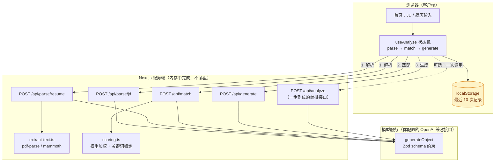

# JobFit AI


> **粘贴一份 JD、丢进一份简历，30 秒拿到匹配评分、差距分析、定制简历 Bullet、Cover Letter 和 10 道面试预测题。**
> 所有结论都标注来源（简历哪一段 / JD 哪一条），简历不落库，一键导出 Markdown / PDF。

> 📽 **演示 GIF 待录制** —— 仓库暂未包含 `docs/demo.gif`（不提供伪造的演示素材）。
> 按 [`docs/DEMO.md`](docs/DEMO.md) 的 60 秒分镜录完后把文件放到 `docs/demo.gif`，
> 再把这一段替换为 `` 即可。

**在线 Demo**：部署到 Vercel 后在此填入你的地址（步骤见 [`docs/DEPLOY.md`](docs/DEPLOY.md)）。

---

## 目录

- [它解决什么问题](#它解决什么问题)
- [功能](#功能)
- [快速开始](#快速开始)
- [技术栈](#技术栈)
- [架构](#架构)
- [API 说明](#api-说明)
- [评分规则](#评分规则)
- [隐私说明](#隐私说明)
- [路线图](#路线图)
- [贡献指南](#贡献指南)
- [许可](#许可)

---

## 它解决什么问题

求职时真正费时间的不是"投递"，而是**为每个岗位重新组织同一段经历**：

- 我这份简历和这个岗位差在哪？差多少？
- 哪些经历该往前放？用什么词说才对得上 JD？
- 求职信怎么写得不像模板？
- 面试官会揪住哪几个点问？

JobFit AI 把这四件事做成一条流水线，并且**守住一条底线：只重组和强化真实经历，不编造任何未发生的事实**。

## 功能

| 模块 | 说明 |
| --- | --- |
| 📊 **匹配评分** | 0-100 分环形进度条，四维拆解：技能覆盖 40% / 经验相关 30% / 关键词 20% / 教育年限 10% |
| 🔍 **差距分析** | 强匹配点（绿）、弱匹配点（黄）、缺失技能（红/黄/绿按严重度）、风险提示 |
| 🔗 **来源标注** | 每条结论都带原文引用，明确标注来自「简历」还是「JD」 |
| ✍️ **定制 Bullet** | XYZ 句式（通过 X，实现 Y，带来 Z），并列出对应的原始表述与命中的 JD 要求 |
| 💌 **Cover Letter** | 中文 300 字以内，3-4 段，引用 JD 具体要求，不复述简历全篇 |
| 🎤 **面试预测** | 10 题：技术 ~5 / 行为 ~3 / 岗位理解 1 / 反向提问 1，每题带考察意图、回答思路、可用素材、可能追问 |
| 📄 **导出** | 一键复制 Markdown、下载 `.md`、浏览器打印为 PDF（打印时自动展开为完整报告） |
| 🕘 **历史记录** | 自动保存最近 10 次分析到浏览器 localStorage，可逐条删除或一键清空 |
| 🌗 **界面** | 中文、卡片式布局、暗色模式、移动端可用 |

## 快速开始

### 1. 准备环境

- Node.js ≥ 18.17
- 任意 OpenAI 兼容的模型接口（官方 OpenAI / DeepSeek / 通义 / Moonshot / One-API / 本地 vLLM / Ollama 都行）

### 2. 安装与配置

```bash
git clone <your-repo-url> jobfit-ai
cd jobfit-ai
npm install

cp .env.example .env.local   # Windows: copy .env.example .env.local
```

编辑 `.env.local`：

```dotenv
OPENAI_API_KEY=sk-xxxxxxxx
OPENAI_BASE_URL=https://api.openai.com/v1
MODEL=gpt-4o-mini
```

三个变量都是服务端专用；`MODEL_TEMPERATURE`、`MODEL_COMPATIBILITY`、`MODEL_OBJECT_MODE` 可选（见 [`.env.example`](.env.example)）。`MODEL_COMPATIBILITY` 默认 `compatible`（走 chat/completions，兼容第三方网关与本地模型），直连 OpenAI 官方并需要 strict structured outputs 时设为 `strict`。

`MODEL_OBJECT_MODE` 默认 `auto`：先用 `response_format: json_object` 拿结构化输出，**被上游拒绝时自动降级为纯文本提取 + 本地 Zod 校验**。所以遇到思考/推理模型报 `Thinking mode does not support this tool_choice`、或网关不支持 `response_format` 时，不用改配置就能跑通；想强制走某条通道（`json` / `tool` / `text`）再显式指定。

### 3. 启动

```bash
npm run dev
# 打开 http://localhost:3000
```

点首页的 **「填入示例，直接体验」**，再点 **「开始分析」**，不需要准备任何材料就能看到完整效果。

### 常用命令

```bash
npm run dev        # 开发（默认 3000 端口）
npm run build      # 生产构建
npm run start      # 运行生产构建
npm run lint       # ESLint
npm run typecheck  # tsc --noEmit
```

## 技术栈

| 层 | 选型 | 说明 |
| --- | --- | --- |
| 框架 | Next.js 14（App Router）+ TypeScript | 服务端 API Routes 承担文件解析与模型调用 |
| 样式 | Tailwind CSS + shadcn/ui | 组件源码直接落在 `src/components/ui`，可随意改 |
| 模型 | Vercel AI SDK（`ai` + `@ai-sdk/openai`） | `generateObject` 做结构化输出，兼容任意 OpenAI 接口 |
| 校验 | Zod | 定义 schema，同时也作为输出契约 |
| 上传 | react-dropzone | 拖拽上传 PDF / DOCX / TXT / MD |
| 解析 | pdf-parse（PDF）、mammoth（DOCX） | 仅在服务端运行，不落盘 |
| 渲染 | react-markdown + remark-gfm | Markdown 预览与导出一致 |
| 存储 | localStorage | 历史记录留存在用户浏览器，服务端无数据库 |
| 部署 | Vercel | 零配置，见 `vercel.json` |

## 架构



**关键设计**

1. **两步打分，防止模型"讨好"**：模型只负责语义判断（技能覆盖、经验相关度…），总分与权重由 `src/lib/scoring.ts` 本地计算；同时本地用确定性的关键词匹配算一遍覆盖率，若模型分数与客观值偏差超过 35 分，自动向客观值收敛一半。纯靠模型心算总分的方案，最容易出现"什么都 80 分"。
2. **前端 4 步调用而非 1 步**：进度真实、单步失败不必整体重跑、解析结果可复用。`/api/analyze` 保留给 API 调用方做一次性编排。
3. **生成拆成 3 个并行请求**：Bullet / Cover Letter / 面试题各自 schema 更小，输出更不容易被截断，也比串行更快。

详细说明见 [`docs/ARCHITECTURE.md`](docs/ARCHITECTURE.md)。

## API 说明

所有路由都在服务端运行（`runtime = "nodejs"`），统一返回 `{ error, code }` 形状的错误。

| 方法 | 路径 | 入参 | 出参 |
| --- | --- | --- | --- |
| POST | `/api/parse/jd` | `{ text }` | `{ jd, meta }` |
| POST | `/api/parse/resume` | `multipart: file \| text`，或 `{ text, fileName? }` | `{ resume, meta }` |
| POST | `/api/match` | `{ resume, jd, resumeText?, jdText? }` | `{ match }` |
| POST | `/api/generate` | `{ resume, jd, match, resumeText? }` | `{ generation }` |
| POST | `/api/analyze` | `multipart: jd + resumeFile/resumeText`，或 `{ jd, resume }` | `{ result }` |

错误码：`MISSING_API_KEY` / `EMPTY_INPUT` / `UNSUPPORTED_FILE` / `PARSE_FAILED` / `MODEL_FAILED` / `BAD_REQUEST` / `UNKNOWN`。

示例：

```bash
curl -X POST http://localhost:3000/api/parse/jd \
  -H 'Content-Type: application/json' \
  -d '{"text":"高级前端工程师...（JD 全文）"}'
```

## 评分规则

| 维度 | 权重 | 判断依据 |
| --- | --- | --- |
| 技能覆盖 `skillCoverage` | 40% | JD 中 `must` 技能在简历中被证明的比例，硬性要求缺失显著扣分 |
| 经验相关 `experienceRelevance` | 30% | 工作/项目经历与岗位职责的相似度，业务领域也计入 |
| 关键词覆盖 `keywordCoverage` | 20% | JD 核心关键词在简历中的命中情况（含近义表述） |
| 教育/年限 `educationSeniority` | 10% | 学历、专业相关性、年限与 JD 要求的匹配度 |

总分 = Σ(维度分 × 权重)，由服务端计算，模型不参与算术。

## 隐私说明

- 简历与 JD **只在本次请求的内存中处理**：服务端不写数据库、不写文件、不做内容日志落盘。
- 数据会发送到**你自己配置的** `OPENAI_BASE_URL`；用本地模型时数据不出机器。
- 历史记录存在**你自己浏览器的 localStorage**，最多 10 条，可随时删除或清空。
- 不爬取任何网站、不做自动投递、不接入第三方统计脚本。
- 详细链路见首页底部声明与 [`/privacy`](src/app/privacy/page.tsx)。

## 路线图

- [x] v0.1 匹配评分 / 差距分析 / 定制 Bullet / Cover Letter / 面试题 / 导出 / 历史记录
- [ ] v0.2 中英双语输出（英文 JD 自动英文简历表达）
- [ ] v0.3 一份简历对多个 JD 的批量对比打分
- [ ] v0.3 可选 `Prisma + SQLite` 服务端历史（默认关闭，需显式开启）
- [ ] v0.4 DOCX 简历模板导出（原格式替换 bullet）
- [ ] v0.4 流式输出（`streamObject`）+ 逐块渲染，降低首字等待
- [ ] v0.5 本地模型一键配置（Ollama / vLLM 预设）

## 贡献指南

完整的开发约定见 [`CONTRIBUTING.md`](CONTRIBUTING.md)。欢迎 PR 与 Issue，尤其欢迎：

- 更好的 **Prompt 与评分校准**（附上你的测试样本与前后对比，最有价值）
- 新的简历格式解析（如 `.doc`、HTML 简历）
- 更多导出目标（DOCX、PDF 直出）
- 中文文案与可访问性改进

流程：

1. Fork 并新建分支：`git checkout -b feat/your-feature`
2. 提交前确保 `npm run lint` 与 `npm run typecheck` 通过
3. PR 描述里写清**动机、改动、验证方式**（截图或复现命令）
4. 涉及 Prompt / 评分逻辑的改动，请在 PR 中附上同一份样本的前后结果对比

不要提交：真实简历样本（含个人信息）、任何 API Key、`.env.local`。

## 许可

[MIT](LICENSE)
