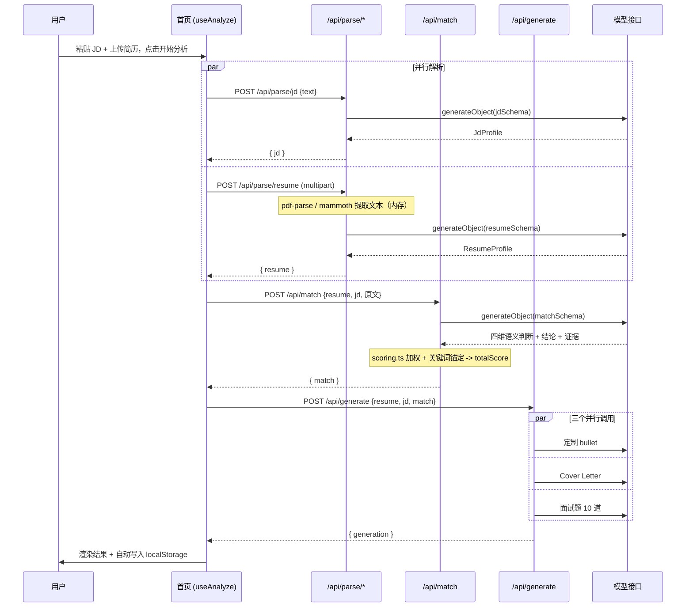

# 架构与设计说明

## 目录结构

```
jobfit-ai/
├─ src/
│  ├─ app/
│  │  ├─ layout.tsx                 全局布局（主题 Provider / Header / Footer / Toaster）
│  │  ├─ page.tsx                   首页：JD + 简历输入、分析、结果展示
│  │  ├─ globals.css                主题令牌（含暗色）、差距三色、打印样式
│  │  ├─ history/page.tsx           历史记录（localStorage）
│  │  ├─ privacy/page.tsx           隐私说明
│  │  ├─ not-found.tsx              404
│  │  └─ api/
│  │     ├─ parse/jd/route.ts       JD -> JdProfile
│  │     ├─ parse/resume/route.ts   文件/文本 -> ResumeProfile
│  │     ├─ match/route.ts          简历 + JD -> MatchReport
│  │     ├─ generate/route.ts       -> bullets + coverLetter + interview
│  │     └─ analyze/route.ts        一步到位的编排接口
│  ├─ components/
│  │  ├─ ui/                        shadcn/ui 组件源码（可随意改）
│  │  ├─ jd-input.tsx               左侧 JD 输入
│  │  ├─ resume-input.tsx           右侧上传/粘贴
│  │  ├─ result-view.tsx            结果总览 + 页签
│  │  ├─ match-report.tsx           评分环、四维、强/弱/缺/风险
│  │  ├─ tailored-bullets.tsx       定制 bullet
│  │  ├─ cover-letter.tsx           Cover Letter
│  │  ├─ interview-questions.tsx    面试题
│  │  ├─ export-bar.tsx             复制/下载/打印
│  │  ├─ markdown-preview.tsx       Markdown 预览（react-markdown）
│  │  ├─ evidence-list.tsx          证据引用渲染
│  │  ├─ header.tsx / site-footer.tsx / theme-toggle.tsx / providers.tsx
│  ├─ hooks/
│  │  ├─ use-analyze.ts             四步流水线状态机（含取消、计时）
│  │  └─ use-history.ts             localStorage 历史
│  ├─ lib/
│  │  ├─ ai/
│  │  │  ├─ provider.ts             模型接入（OpenAI 兼容）
│  │  │  ├─ prompts.ts              全部 Prompt
│  │  │  ├─ schemas.ts              Zod schema
│  │  │  └─ pipeline.ts             业务编排：parse/match/generate
│  │  ├─ api/
│  │  │  ├─ http.ts                 统一错误映射 + 报文工具
│  │  │  └─ request.ts              multipart / JSON 输入归一化
│  │  ├─ parsing/extract-text.ts    PDF/DOCX/TXT 文本提取与清洗
│  │  ├─ scoring.ts                 权重加权、关键词锚定、维度兜底
│  │  ├─ markdown.ts                结果 -> Markdown（导出契约）
│  │  ├─ storage.ts                 localStorage 读写
│  │  ├─ sample-data.ts             示例 JD / 简历
│  │  ├─ types.ts                   全项目共享类型
│  │  └─ utils.ts                   cn / 分数配色 / 时间格式化
│  └─ types/pdf-parse.d.ts          pdf-parse 类型声明
├─ docs/                            DEMO.md / ARCHITECTURE.md / DEPLOY.md
├─ public/favicon.svg
├─ tailwind.config.ts / postcss.config.mjs / next.config.mjs
└─ vercel.json
```

## 数据流



## 关键决策

### 1. 总分不用模型算

模型给四个维度的分数与理由，总分由 `computeTotalScore` 按固定权重计算。原因：

- 模型算术不可靠（尤其长上下文里），会出现"维度分数加起来不等于总分"的自相矛盾；
- 权重是我们的产品决定（技能 40% / 经验 30% / 关键词 20% / 教育年限 10%），不该交给模型自由发挥。

### 2. 关键词锚定：抑制"讨好式打分"

LLM 评分最常见的失效模式是"都挺好"，尤其在被要求评估用户自己提供的简历时。

`src/lib/scoring.ts` 里用确定性方法再算一遍可验证的部分：

- `skillCoverage`：JD 的 `must` 技能权重 2、`nice` 权重 1，在简历全文中做术语命中（拉丁术语用词边界匹配，避免 `Go` 命中 `Google`）；
- `keywordCoverage`：JD 关键词列表在简历中的命中比例。

若模型分数与客观值偏差超过 **35 分**，把它向客观值拉近一半，并在 `rationale` 里注明"本地关键词校验值为 X"。模型漏返回某个维度时，直接使用客观值兜底，而不是给个好看的默认分。

### 3. 前端 4 步调用，而不是 1 步

`/api/analyze` 一次到位更省事，但前端默认走 4 步：

- **进度是真实的**：解析 → 匹配 → 生成，每一步的耗时和失败点可观测，失败时能给出精确提示（例如"模型接口调用失败"而不是笼统的"分析失败"）；
- **可复用**：`/api/match` 与 `/api/generate` 都接受外部传入的结构化画像，换 JD 时不必重新解析简历，也便于单独调用做实验；
- **可定位**：失败时能明确是哪一步坏了（解析 / 匹配 / 生成），而不是一个笼统的"分析失败"。

`/api/analyze` 保留给"我只想发一个请求"的 API 调用方，内部复用同一套 `pipeline.ts`，不存在两套逻辑。

> 注意：当前前端在失败后仍需整体重跑（UI 还未提供"从失败的那一步继续"），这是路线图里的待办。

### 4. 生成拆成三个并行请求

Bullet、Cover Letter、面试题各自一份 schema，用 `Promise.all` 并发。原因：单个大 schema 输出极易在 `max_tokens` 附近被截断（表现为 JSON 解析失败），拆开后每份输出更短、更稳定，总耗时也更低。

### 5. 文件名 / 文本解析都在服务端

`pdf-parse` 与 `mammoth` 依赖 Node 原生能力，因此：

- API 路由声明 `runtime = "nodejs"`；
- `next.config.mjs` 里 `serverComponentsExternalPackages: ["pdf-parse", "mammoth"]`，避免被 Webpack 打包；
- 从 `pdf-parse/lib/pdf-parse.js` 导入而不是入口文件（入口内含读取本地测试 PDF 的调试代码，会直接报错）。

### 6. 历史记录放 localStorage，而不是数据库

隐私承诺要能被代码验证：整个项目没有数据库依赖，`src/lib/storage.ts` 是唯一的持久化层。索引与详情分开存（`jobfit:history:index` + `jobfit:history:result:<id>`），列表渲染只读索引；写入配额溢出时优先丢弃最旧的详情。

## 扩展点

| 想改什么 | 改哪里 |
| --- | --- |
| 换模型 / 换网关 | `.env.local` 的 `MODEL`、`OPENAI_BASE_URL`、`MODEL_COMPATIBILITY` |
| 调整评分权重 | `src/lib/scoring.ts` 的 `DIMENSION_WEIGHTS`（同时更新 README 表格） |
| 改写作风格 / 输出结构 | `src/lib/ai/prompts.ts` 与 `src/lib/ai/schemas.ts`（两者必须同步改） |
| 支持新文件格式 | `src/lib/parsing/extract-text.ts` 的 `detectKind` / 提取分支 |
| 加导出格式 | `src/lib/markdown.ts` + `src/components/export-bar.tsx` |
| 接服务端历史 | 新增 `src/lib/storage-server.ts`，在路由里替换 hook 调用即可（默认不启用） |
